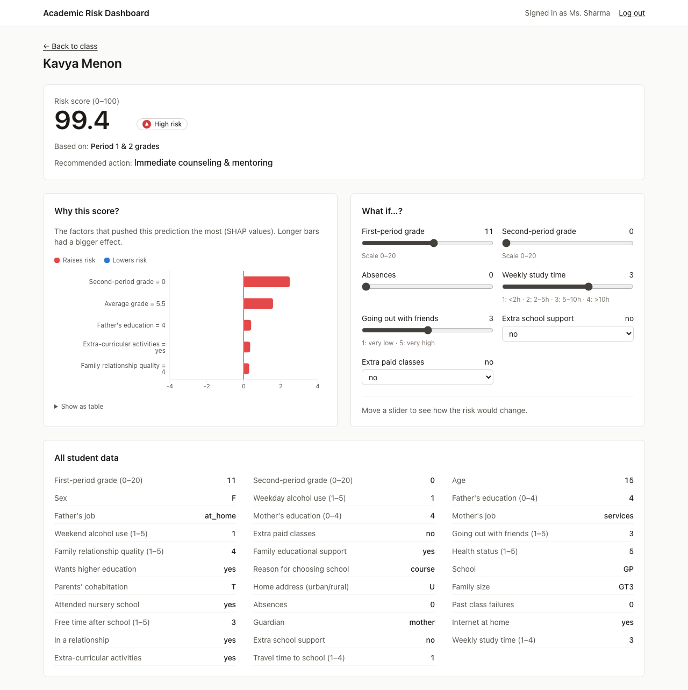
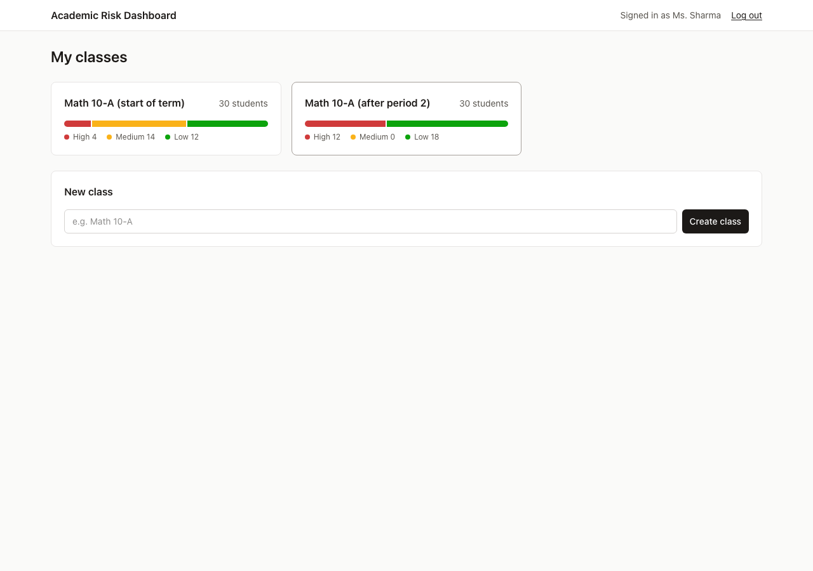
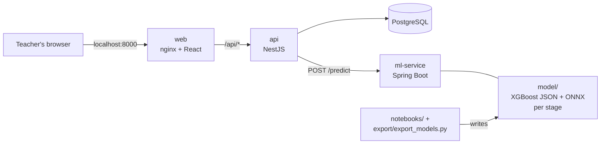
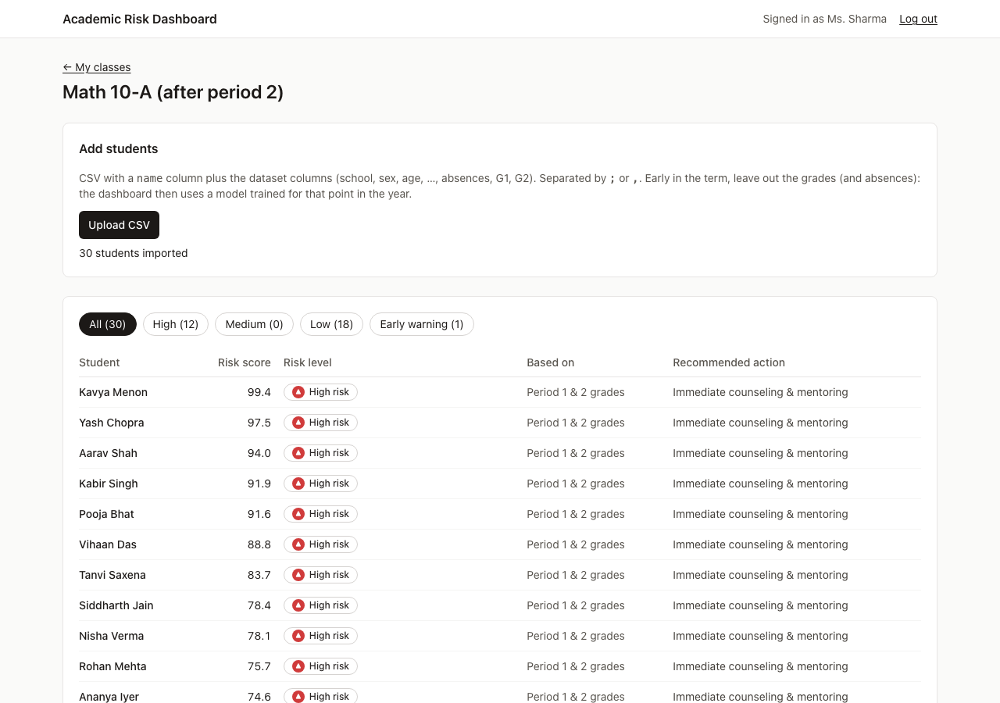
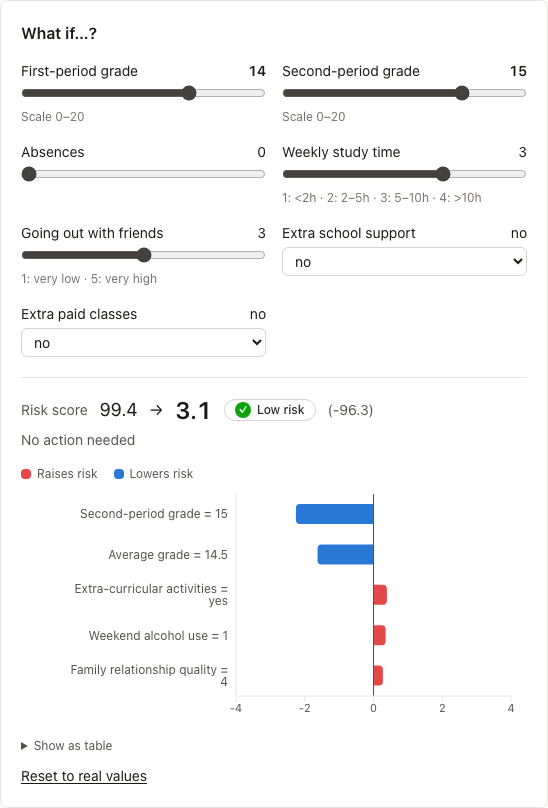
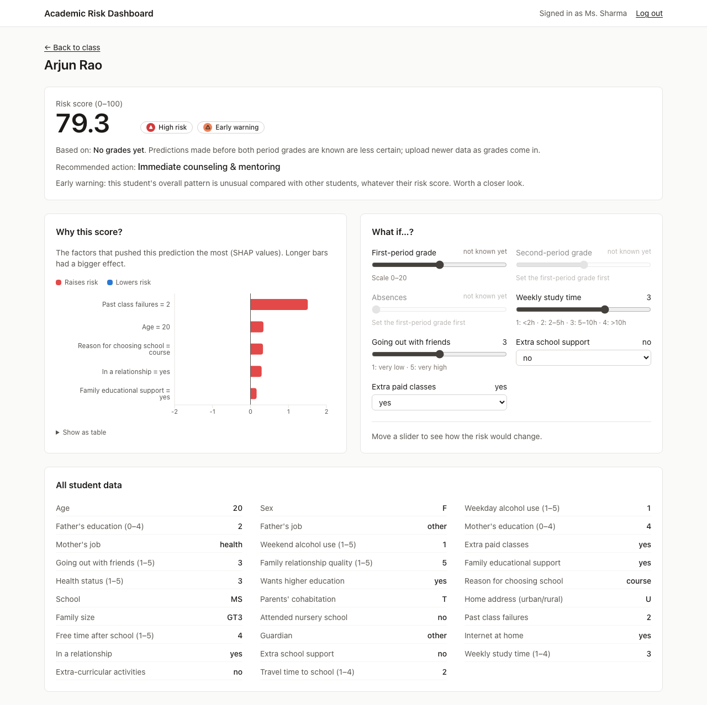

# Explainable Early Academic Risk Detection System

[](https://github.com/Punit481/Explainable-Early-Academic-Risk-Detection-System/actions/workflows/ci.yml)

A teacher dashboard that flags students at risk of failing a course, **explains every
prediction**, and gets more accurate as the school year goes on. A teacher uploads a class
as a CSV and sees each student's risk, the factors behind it (SHAP), an early-warning flag
for unusual students, and a recommended action. A "what if" simulator then shows how the
risk would change if, say, the next grade improved.

Built on the [UCI Student Performance dataset](https://archive.ics.uci.edu/dataset/320/student+performance)
(395 students, math course). A student counts as at risk when their final grade is below
10 out of 20.



## What it does

- **Risk score (0–100) and level**: Low (≤ 30), Medium (≤ 70) or High, from XGBoost.
- **Explanation**: the five factors that pushed this student's score up or down, as SHAP values.
- **Early warning**: an Isolation Forest flags students whose overall pattern is unusual,
  even when their risk score is low.
- **Recommended action**: counseling, monitoring or a behavioral review, depending on
  level and early warning.
- **Works from the start of the term**: three models, one for each point in the year. The
  dashboard picks the one that matches the data a teacher has uploaded.
- **What-if simulator**: change grades, absences, study time and so on, and see the new
  prediction straight away (nothing is saved).

## Results: how early can it warn?

The question that matters for an *early* warning system is how good the prediction is
before the grades are in. Each stage has its own model, trained only on what a teacher
would know at that point. All of them are tested on the same 79 held-out students.

| Prediction made… | Uses | Accuracy | At-risk students flagged¹ | AUC (test) | AUC (5-fold CV)² |
|---|---|---|---|---|---|
| After period 2 | both period grades | 92.4% | 88.5% | 0.970 | 0.964 |
| After period 1 | first-period grade | 83.5% | 88.5% | 0.947 | 0.911 |
| Start of term | background only (no grades, no absences) | 72.2% | 65.4% | 0.732 | 0.617 |

¹ Share of truly at-risk students the dashboard shows as Medium or High.
² Cross-validated on the training students, because a single 79-student test set is noisy.

**How to read this:**

- **Accuracy is misleading early on.** A third of students are at risk, so always guessing
  "not at risk" already scores 67.1%. At the start of term the model is only slightly
  better than that by accuracy.
- **AUC is the honest number.** It measures how often an at-risk student is ranked above a
  safe one (0.5 is guessing, 1.0 is perfect). At the start of term, cross-validated AUC is
  about 0.62: useful for deciding *who to check on first*, not a verdict. The dashboard
  says so on every early prediction.
- **One good grade changes everything.** With just the first-period grade, AUC jumps to
  about 0.91–0.95. That's why the dashboard tells teachers to upload newer data as grades
  come in.
- **The models are tuned to be honest about uncertainty.** XGBoost's default settings
  memorize this small dataset and gave scores of 99 to students with no grades at all.
  Shallow trees that learn slowly (depth 2, learning rate 0.05, 200 trees) improved both
  AUC and calibration (Brier score) at every stage. Early scores now spread into Medium
  instead of jumping to the extremes.



*The same 30 students at two points in the year. With no grades the model spreads them
across High / Medium / Low. Once both grades are known it is confident.*

All numbers are regenerated by `export/export_models.py` into
[`model/metrics.json`](model/metrics.json).

## How it works



- **Python is only used for training.** `export/export_models.py` trains the models and
  exports them in portable formats: XGBoost as JSON, and the Isolation Forest as ONNX. It
  also writes the feature mappings and a set of test cases with Python's exact answers.
- **ml-service** (Java, Spring Boot) loads the models with XGBoost4J and ONNX Runtime. For
  each student it:
  1. picks the stage from which grades are present;
  2. encodes the fields exactly as the Python preprocessing did;
  3. returns the risk, level, early-warning flag, action and top SHAP factors.
- **api** (NestJS, PostgreSQL) handles teacher accounts (JWT), classes, CSV uploads and
  what-if requests. Each teacher only sees their own classes. Database changes are
  versioned migrations.
- **web** (React, TypeScript) is the dashboard. The SHAP chart's colors were checked for
  color-blind safety, and risk levels always carry an icon and a label, never color alone.
- **Docker Compose** runs all four parts. Only the web server is exposed; it forwards
  `/api/*` to the api.

### Keeping Python and Java in agreement

The models are trained in Python but run in Java, so a silent mismatch would produce
wrong predictions that still *look* fine. Several checks prevent that:

- For every stage, `model/<stage>/test_cases.json` holds real students with Python's risk
  probability, anomaly flag and **every SHAP value**. The Java tests must match the
  probability to within 0.00001, pick the same top-5 factors in the same order, and match
  each SHAP value to within 0.0001.
- The export checks that XGBoost's built-in SHAP values (the ones Java uses) are identical
  to the `shap` library's. The maximum difference is 0.
- The ONNX Isolation Forest agrees with scikit-learn on 100% of students.
- The ml-service Docker image runs these tests while it builds, so a mismatched model can't
  ship.

## Screenshots

| Class view | What-if simulator |
|---|---|
|  |  |

Start of term, before any grades: the explanation relies on background factors like past
failures.



Regenerate these with `npm run screenshots` in `web/` while the stack is running. The
script also checks the key results as it clicks through.

## Run it

Requires Docker.

```
cp .env.example .env    # then replace both values, e.g. with: openssl rand -hex 32
docker compose up -d --build
```

Then:

1. Open http://localhost:8000 and create an account.
2. Create a class and upload one of the demo classes. Both contain the same 30 students
   from the test set, so the models never saw them during training:
   - `data/sample_class.csv`: with both period grades
   - `data/sample_class_start_of_term.csv`: no grades or absences yet
3. Stop with `docker compose down`. Your data is kept; `down -v` deletes it.

### Retrain the models

Requires Python 3.12. `requirements.txt` pins exact versions, so retraining reproduces
the committed models byte for byte (CI checks this on every push).

```
python3.12 -m venv .venv
.venv/bin/pip install -r requirements.txt
.venv/bin/python export/export_models.py    # rewrites model/ and the demo CSVs
```

The research notebook runs in the same environment (`.venv/bin/jupyter notebook`).

### Development and tests

| Part | Folder | Tests |
|---|---|---|
| Model export | `export/` | `python export/export_models.py` (prints all checks) |
| ml-service | `ml-service/` | `mvn test`: Python-vs-Java checks for every stage |
| api | `api/` | `npm test` (unit) and `npm run test:e2e` (needs PostgreSQL) |
| web | `web/` | `npm test` (components) and `npm run screenshots` (browser walkthrough) |

All of these except the browser walkthrough also run on GitHub Actions for every push
and pull request ([`.github/workflows/ci.yml`](.github/workflows/ci.yml)), along with
checks that re-exporting reproduces the committed models, that the notebook still runs,
and that every Docker image builds. Setup details for each part are in
[`CLAUDE.md`](CLAUDE.md).

## Repository structure

```
data/          UCI dataset + demo class CSVs
notebooks/     original research notebook (model comparison, SHAP, anomaly detection)
export/        trains the production models and exports them for Java
model/         exported models, metadata, metrics and test cases (one folder per stage)
ml-service/    Spring Boot prediction service
api/           NestJS backend
web/           React dashboard
figures/       notebook figures + dashboard screenshots
reports/       research write-up (PDF)
```

## Research notebook

[`notebooks/Academic_Risk_Detection.ipynb`](notebooks/Academic_Risk_Detection.ipynb) is
where the approach was developed. It covers preprocessing, feature engineering
(attendance, average grade, grade trend), model comparison, feature selection, SHAP
explanations, anomaly detection, risk scoring and intervention rules. It uses all
features, including both period grades:

| Model | Accuracy | Recall | F1 |
|---|---|---|---|
| Logistic Regression | 89.9% | 80.8% | 84.0% |
| Decision Tree | 83.5% | 73.1% | 74.5% |
| XGBoost | **92.4%** | **88.5%** | **88.5%** |

A reduced model using only the 10 most important features did worse (89.9% accuracy,
85.2% F1, same recall), so the full feature set was kept.
Figures: [model comparison](figures/Model%20Comparison.png),
[confusion matrix](figures/Confusion%20Matrix.png),
[feature comparison](figures/Feature%20Comparison.png),
[risk distribution](figures/Risk%20Distribution.png).

## Limitations

- **Small, specific data.** 395 students in a math course at two Portuguese schools. The
  models would need retraining and re-validation before use anywhere else.
- **Absences are yearly totals** in the dataset. The start-of-term model leaves them out;
  the after-period-1 model uses them as an approximation of "absences so far".
- **Sensitive attributes.** The models use features such as sex, home address and parents'
  jobs. They may predict well, but they raise fairness questions: a real deployment should
  test whether removing them costs accuracy, and check error rates per group.
- **A tool for attention, not a decision.** Especially early in the term, scores should
  prompt a conversation, not a label.

## Technologies

- **Machine learning**: Python, pandas, scikit-learn, XGBoost, SHAP, skl2onnx, ONNX Runtime
- **ml-service**: Java 21, Spring Boot 4, XGBoost4J, ONNX Runtime (Java)
- **api**: Node.js, NestJS, TypeORM, PostgreSQL, JWT, bcrypt
- **web**: React 19, TypeScript, Vite, Tailwind CSS, Recharts, React Router
- **Testing**: JUnit, Vitest, Testing Library, Supertest, Playwright
- **Deployment**: Docker, Docker Compose, nginx
